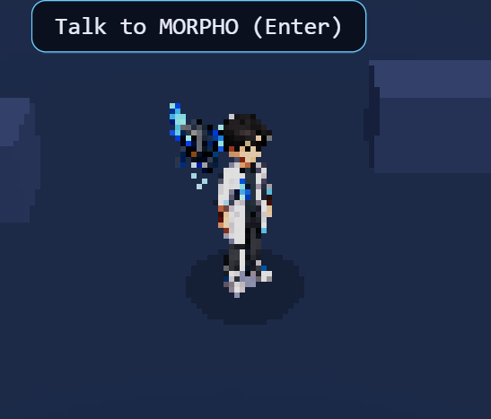

---
noteId: "6466c7906caf11f1b0b095ffea814799"
tags: []

---

# PROJECT MORPHO — Pixel-3D Interactive Hub

**Design spec · 2026-06-20**
**Status:** Approved (brainstorming), pending implementation plan

---

## 1. Why this exists

PROJECT MORPHO is a browser-based educational AI-literacy game for teens. The driving
concern is engagement: **the teens need to *want* to play it.** The reference experience
is [messenger.abeto.co](https://messenger.abeto.co/) — pressing **BEGIN** transports you
*into* a living, hand-crafted world rather than swapping to a flat menu/game screen. That
threshold moment ("I entered a world") is the feeling we are chasing.

Intended gameplay loop (from the user): you **go through your messages**, then **use the
arrow keys to move through the world and enter your challenges.**

The user's two stated engagement levers:

- **B — Aliveness:** the world moves and feels alive.
- **C — Place-ness:** it is one continuous place you are *inside of*, not a sequence of
  separate screens/panels.

A flat painted backdrop with a sprite walking on it was explicitly rejected — "those are
not interactive." The user wants a **genuinely interactive 3D scene**, on the condition that
it **does not cost much money.**

## 2. The core decision

Build **one interactive 3D world you walk into**, rendered in a **"pixelated 3D" art style**
(à la the Steam games *Lunistice* and *Demon Turf*): real low-poly 3D, rendered to a low
resolution with a curated palette, so it reads as crisp, colorful, artsy pixel art that you
can still move through in 3D. Keep MORPHO's existing game logic. This is "Approach A —
Hybrid hub" from brainstorming: prove the feeling in a single 3D room before converting the
whole game.

**Characters use the *Demon Turf* trick:** Amalia's hand-drawn 2D character art stands in the
3D world as **camera-facing billboards** — flat cards that are always turned toward the
camera. Her art *is* the cast (not just side portraits), living inside an interactive
pixel-3D space. This is the cheapest, best-performing, and most distinctive option, and it
re-centers the art assets the project already has.

**Money cost ≈ €0.** Engine (Three.js / react-three-fiber) is open source; world props come
from free CC0 low-poly libraries (Kenney, Quaternius); characters reuse Amalia's existing
background-removed PNGs. The real cost is **development time** plus replacing the PixiJS
render layer for the hub — not euros.

### Rejected / deferred alternatives
- **Smooth (non-pixel) 3D + VRoid anime characters + VRM/Mixamo pipeline:** considered, then
  dropped. The VRoid→VRM→Mixamo retargeting was a real time-sink and a heavier GPU load. The
  pixel-3D + billboard route is simpler, cheaper, and faster to the same feeling.
- **Full 3D conversion (Approach B):** retire PixiJS everywhere, every scene 3D. High time +
  risk. Deferred — it is Approach A's natural sequel *if* the slice proves 3D lands.
- **3D "tiny planet" title only (Approach C):** cheap wow on the title, but gameplay stays
  2D, so the immersion does not carry past BEGIN. Rejected as a teaser, not the real thing.
- **Walk a sprite across Amalia's painted scenes:** rejected by user as non-interactive.

## 3. Target platform & the performance strategy

**Web-based**, runs at a URL in the browser (existing Vite + React build). No install. A
Chromebook is essentially a Chrome browser, so a web game is its native strength.

**Primary device: low-end school Chromebooks** (weak integrated GPUs). Historically this was
the project's biggest risk — but the chosen **pixel-3D art style is itself the mitigation**:
the scene is rendered to a small internal resolution (e.g. ~320×180) and upscaled, so the GPU
does a *fraction* of full-resolution work. The aesthetic and the performance budget point the
same direction.

**Chromebook 3D budget (non-negotiable):**
- Low internal render resolution (pixelation pass), then upscale to fill the screen.
- Low-poly everything — simple CC0 props; characters are flat billboards (nearly free).
- Baked / simple lighting; no expensive real-time shadows; minimal post-processing beyond the
  pixel pass.
- Target a **steady 30fps on integrated graphics** (aim higher — pixel rendering gives margin).
- One small room at a time to keep draw calls low.
- **Test on a real or throttled Chromebook during the vertical slice** — before any scale-up.
- Fallback if a low-end Chromebook still struggles: lower the internal resolution further,
  fewer props, simpler palette.

## 4. Architecture

The **render layer** changes; the **game brain** does not.

| Layer | Decision |
|---|---|
| 3D world | `@react-three/fiber` + `@react-three/drei` inside `game/`. The hub is a `<Canvas>`. |
| Pixel look | Render the scene to a **low-resolution render target**, then upscale (nearest-neighbour) for chunky pixels. A curated **limited color palette** + subtle dithering gives the artsy, designed feel (not a generic retro filter). *Lunistice / Demon Turf* clean-and-colorful, not moody PS1 horror. |
| Characters | **Camera-facing billboards** (textured planes) using Amalia's existing background-removed PNGs (`game/public/art/`, via the `remove-bg` pipeline). *Demon Turf* style: 2D hand-drawn characters inside the 3D world. |
| World props | Free **CC0 low-poly** glTF (Kenney / Quaternius): floor, walls, desks, lab gear. Loaded via drei `useGLTF`. |
| Movement | **Arrow-key** movement — walk the avatar through the world (every Chromebook has arrow keys; no mouse needed). Avatar clamped to floor bounds. Proximity to an NPC / challenge raises a "press to enter" prompt. |
| UI / messages / puzzles / dialogue | React DOM overlays **on top of** the canvas. A **messages** view, and the `PuzzlePanel`, rise *over* the dimmed-but-still-rendered 3D world — no screen swap. |

### Reused as-is (rendering-agnostic — survives the change)
- `content/schema.ts`, `game/src/game/ruleEngine.ts`
- Level JSON (e.g. `content/levels/1-1.json`), loader
- Dialogue content, the Zustand store (`game/src/state/store.ts`), XP logic
- **Amalia's character art** (`game/public/art/`) + the `scripts/remove-bg.mjs` pipeline —
  now used directly as billboard textures.

### Retired / parked
- **PixiJS** scene rendering for the hub. The floor-polygon clamp concept
  (`shared/src/geometry.ts`) carries over as 3D floor bounds.

### New
- 3D render layer (Canvas, scene graph, lighting), the **pixelation + palette post-process**,
  the **billboard character system**, arrow-key movement & camera, proximity/interaction
  system, the messages view, in-world XP juice, the BEGIN→world transition.

## 5. Characters

- **Treatment:** Amalia's hand-drawn 2D art as **camera-facing billboards** in the 3D world
  (*Demon Turf* style). Her work is the actual in-world cast you walk up to — not demoted to
  side portraits.
- **Reuses existing assets:** the 12 interns + MORPHO + 2 professors already in
  `game/public/art/`, background-removed via the existing script.
- **Player avatar:** the chosen intern (pick-1-of-12 at the badge photo) appears in-world as a
  billboard, with the existing flip + procedural walk juice reading naturally on a 2D card.
- **Diversity:** the intern cast should be deliberately diverse (skin tone, ethnicity, hair
  texture, gender presentation, visible identity/ability) — this is an educational tool used
  in schools and students should see themselves. Amalia's art direction owns this; the spec
  records it as a first-class principle.
- **Style coherence:** flat 2D characters in a pixel-3D world need grounding (a contact
  shadow / soft drop on the floor, consistent palette) so they read as *in* the scene, not
  pasted on top.

## 6. The continuity flow (the "you enter a world" moment)

```
Title
  → BEGIN
  → in-world loading (in-character, not a blank spinner)
  → camera fades / zooms INTO the 3D lab
  → read incoming MESSAGES (briefing / story beat)
  → use ARROW KEYS to move through the world
  → walk up to a challenge / MORPHO → proximity → "press to enter" prompt
  → puzzle / dialogue panel rises OVER the world (world dimmed but still rendered behind)
  → solve → XP juice fires in-world
  → panel drops → still standing in the same place
```

No hard screen cuts anywhere. Continuity is the mechanism that produces the "entered a
world" feeling.

## 7. First milestone — Vertical slice

Prove the feeling (and Chromebook performance) before betting weeks.

**Scope:**
- **One** low-poly 3D lab room (CC0 props), rendered through the **pixel + palette pass**.
- **Two** billboard characters: player + MORPHO (Amalia's art; player also walks).
- **Arrow-key movement** within floor bounds.
- Approach MORPHO → "press to enter" prompt → the **real `PuzzlePanel`** opens over the world.
- Solving a puzzle fires **XP juice** in-world.
- **Runs at a steady 30fps on a low-end / throttled Chromebook.**

**Success = end-to-end "I entered a world" hit on target hardware.** If it lands, expand to
more rooms/characters and the messages system (toward Approach B). If perf fails, drop to the
documented fallbacks.

## 8. Risks & open questions

- **Chromebook GPU performance** — now *mitigated by the art style itself* (low-res render).
  Still must be verified on a real/throttled Chromebook in the slice.
- **Pixel + palette pass tuning** — getting the "artsy, designed" look (not a cheap filter)
  takes iteration on internal resolution, palette, and dithering.
- **Billboard grounding** — 2D characters need contact shadows / consistent lighting so they
  sit *in* the 3D world rather than floating on it.
- **Parking PixiJS** — confirmed acceptable for the hub.
- **Resolved:** movement is **arrow keys**. Gameplay loop = read messages → move with arrows
  → enter challenges. Characters = Amalia's 2D billboards. Art style = *Lunistice/Demon Turf*
  pixel-3D.
- **Open:** the **messages** system — content, when messages arrive, how they tie to
  challenges — to flesh out in the implementation plan (slice can stub it).
- **Open:** how much of the existing Title/BadgePhoto flow is reused vs. reworked for the
  zoom-into-world transition.

## 9. Out of scope (for now)

- Converting all scenes to 3D (Approach B) — deferred until the slice proves out.
- A full messages/story system — stubbed in the slice, designed later.
- A 3D "tiny planet" title screen (nice-to-have, not required for the core feeling).
- Real-time 3D character models (VRoid/VRM) — billboards replace them.
